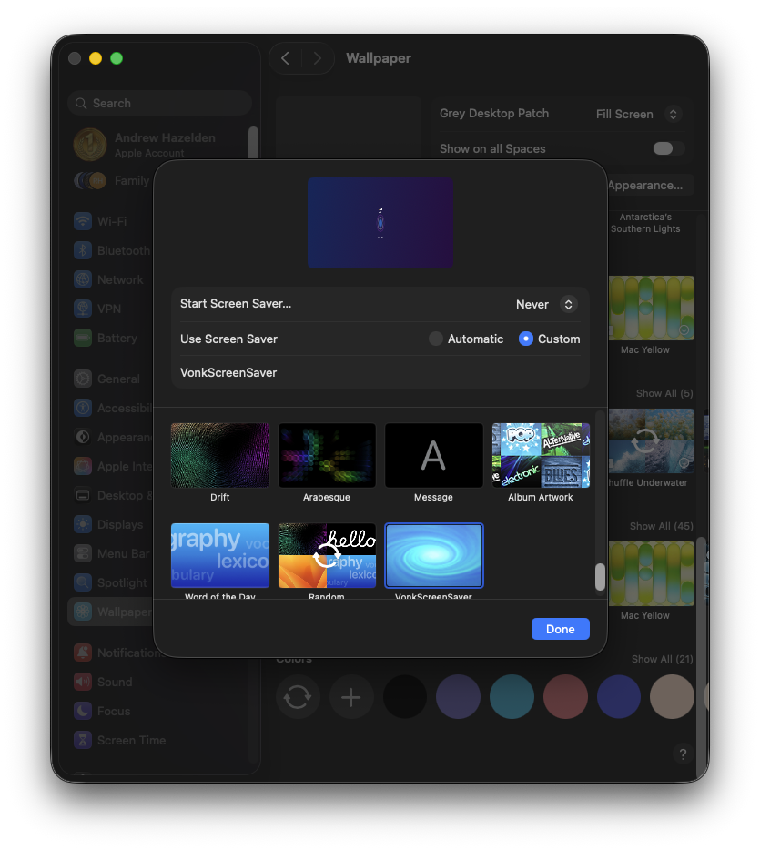

# Screen Savers

The Swift programming language can be used to create your own metal GPU accelerated screen savers.

After being installed, screensavers are controlled using the "System Preferences > Wallpaper > Screen Saver..." window.

Historically, screensavers were developed on macOS using ObjectiveC. This remained the case, even in recent years, because the initial code samples in xCode were written in ObjectiveC when a new Screensaver project is created.

