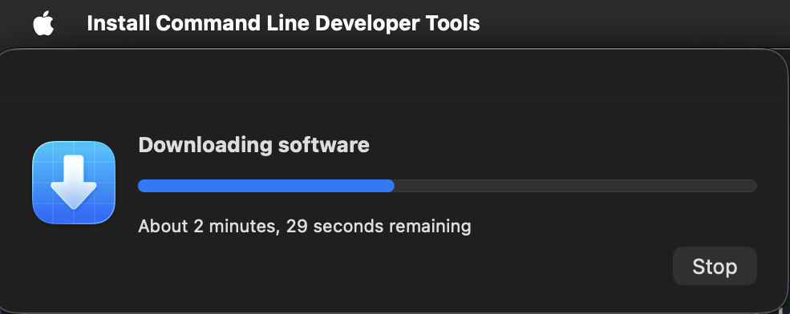
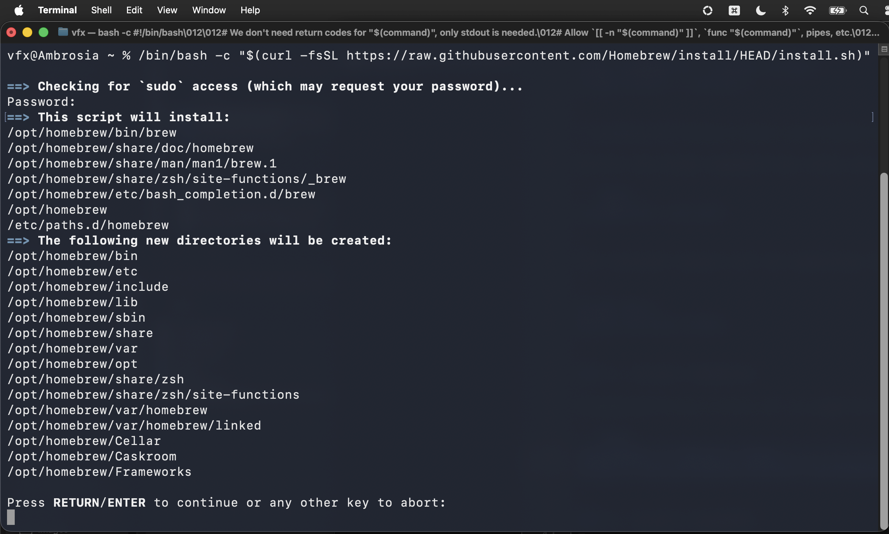
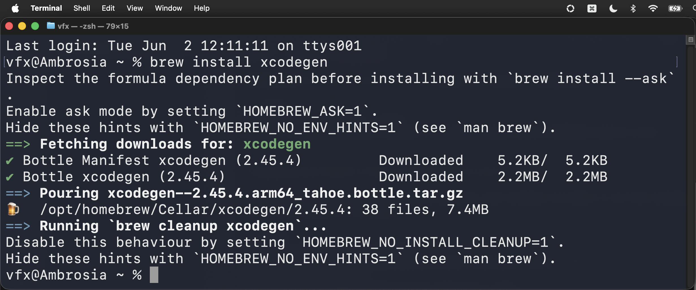
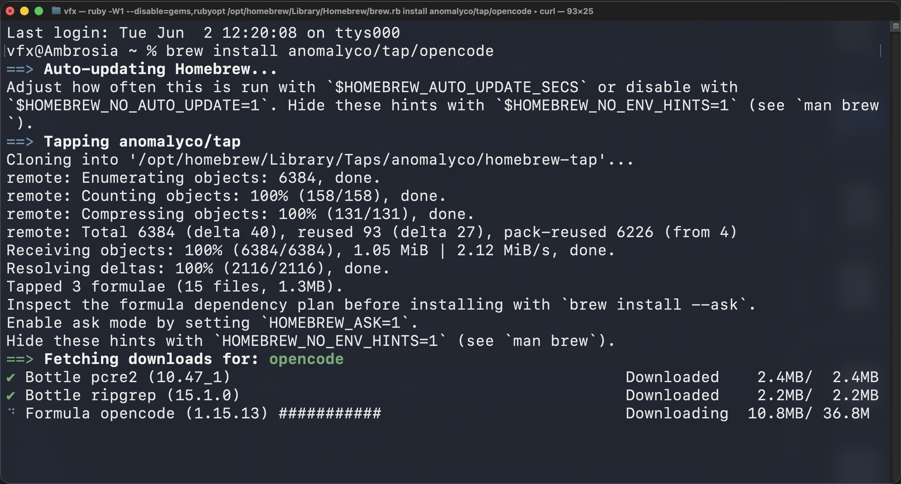
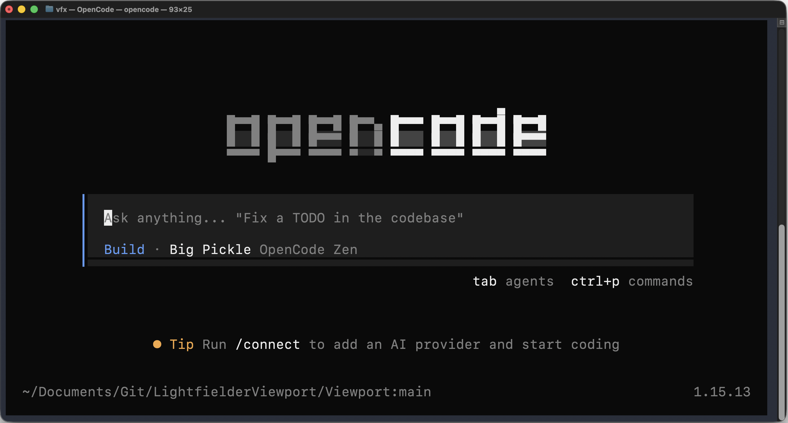

# Installing the Dev Tools

Swift 6 development works best on macOS 26.0+ (Tahoe) when you have the following tools installed:

## 1. Install Xcode

Download and install Xcode 17+ from the Mac App Store or the [Apple Developer site](https://developer.apple.com/xcode/).

After installation, accept the license and install the command-line tools:

```bash
sudo xcodebuild -license accept
xcode-select --install
```



Verify the Xcode command-line tools are active:

```bash
xcodebuild -version
```

The terminal output will be something like:

```
Xcode 26.5
Build version 17F42
```

## 2. Install Homebrew

[Homebrew](https://brew.sh) is used to install XcodeGen:

```bash
/bin/bash -c "$(curl -fsSL https://raw.githubusercontent.com/Homebrew/install/HEAD/install.sh)"
```



After Homebrew finishes installing you can choose to add it to the sytem PATH environment variable:

```bash
echo >> /Users/vfx/.zprofile
echo 'eval "$(/opt/homebrew/bin/brew shellenv zsh)"' >> /Users/vfx/.zprofile
eval "$(/opt/homebrew/bin/brew shellenv zsh)"
```

## 3. Install xcodegen

xcodeGen makes it easy to generate a new `.xcodeproj` file from a `project.yml` configuration file. You can install xcodegen from homebrew using:

```bash
brew install xcodegen
```



## 4. Apple SF Symbols

Sift UI based apps typcially use Apple's [SF Symbols](https://developer.apple.com/sf-symbols/) for menu and user interface icons.

## 5. Install OpenCode (Optional)

[OpenCode](https://opencode.ai) is a CLI tool for interacting with AI-powered coding agents from the terminal. It can be used to edit code, run builds, and manage git operations during development.

```bash
brew install anomalyco/tap/opencode
```



Verify the installation:

```bash
opencode --version
```

The terminal output will be something like:

```
1.15.13
```

Use OpenCode to edit the application's source code:

```bash
cd $HOME/Documents/Git/Path/To/Code/;opencode
```




