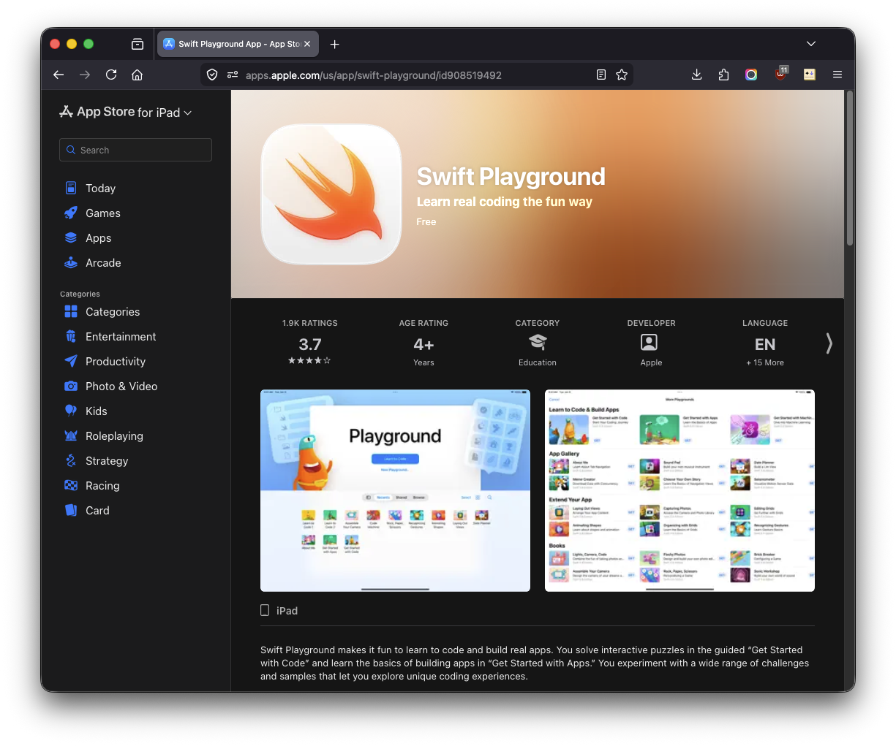
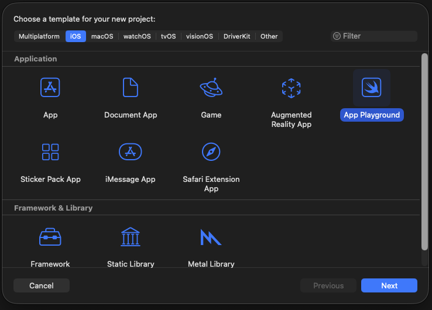

# Swift Playgrounds

## Overview

If you've enjoyed using interactive REPL scripting interfaces, or notebook tools like Juptyer Notebook or Google Collab then you will probably have a lot of fun with [Swift Playgrounds](https://developer.apple.com/swift-playground/) in Xcode.

Playgrounds make it a visual process to watch a Swift coding demo run, and to live code new ideas on the fly. You can track the changes to invidiual variables, and see the progress of the code execution. Images and real-time 3D content can be interacted with while the Playground demo is running.

There is a tablet version of the [Playground app](https://apps.apple.com/us/app/swift-playground/id908519492) that can be used on an iPadOS device to access your shared iCloud based files that can also be used on a macOS system, too.

# New Playground

1. Start the Xcode app.

2. In the Xcode "New Project" dialog, select your desired platform (like iOS or macOS). Then click on the option to create an Application type called an "App Playground". Click the Next button to continue.

