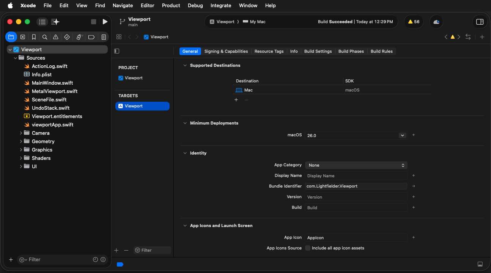
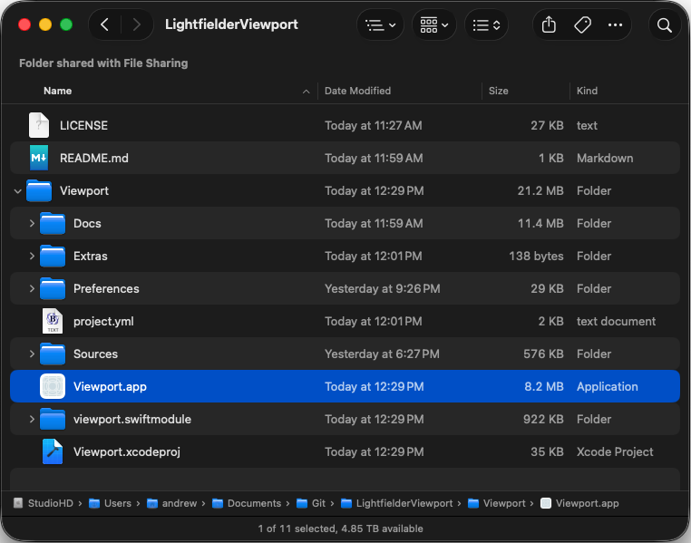

# Using xcodegen

[xcodegen](https://xcodegen.com/) is an amazing cli-based toolset. It allows you to use a YAML based project configuration file named "project.yml" to quickly re-generate an xcode project from scratch.

This toolset makes it super easy to revise ".xcodeproj"project settings, or create variations of your app for several different platforms without getting bogged down in project file patching.

With your project.yml file you can define the code signing options, and build deliverables in a way that is agentic coding friendly.

## Creating a new project

xcodegen helps you make new Xcode project files. The cli tool is typically run from the terminal window, launched by a shell script, or used inside an an agetic coding session.


To use the xcodegen cli program, you start by changing the working directory to the location where the project.yml file is located. 

The xcodegen cli tool is then used to generate a fresh .xcodeproj file.

You can use the simple command:

```bash
xcodegen generate
```

or you can specify the specific project filename to use:


```bash
xcodegen generate --spec project.yml
```

## Compiling the Xcode Project

Once your .xcodeproj file has been created/refreshed you can either build it directly from the command line:

```bash
xcodebuild -project Viewport.xcodeproj -scheme Viewport build -allowProvisioningUpdates
```

Or you can open the project in a new Xcode GUI session:

```bash
open -a Xcode Viewport.xcodeproj
```

The Xcode project can be built from the Xcode IDE sesion using the "Product > Build" menu or the `Cmd + B` hotkey. This is most useful for catching build issues and for visually debugging the new application you are creating.



It is possible to configure your Xcode project file so the final compiled application is placed in the same folder location as the xcodegen `project.yml` file. This can save a lot of time hunting in temporary build folders over and over again.


